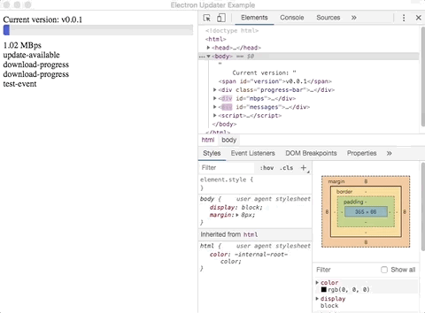

# electron-updater DigitalOcean Spaces Example



This repo contains the **bare minimum code** to have an auto-updating Electron app using [`electron-updater`](https://www.electron.build/auto-update) with releases stored on DigitalOcean's Spaces.  

Also see [`electron-builder Spaces Docs`](https://www.electron.build/configuration/publish.html#spacesoptions).  

Thanks to [`The original example`](https://github.com/iffy/electron-updater-example) to get this started.  

### macOS apps must be signed and notarized
The link below is a good start:  
https://kilianvalkhof.com/2019/electron/notarizing-your-electron-application/  

## Getting Started

### 1. Create a Space on DigitalOcean
Something like https://xxxxxxxxxx.nyc3.digitaloceanspaces.com where `xxxxxxxxxx` is the name of the space.

### 2. Generage Space access keys
[`This is a good start`](https://www.digitalocean.com/community/tutorials/how-to-create-a-digitalocean-space-and-api-key).  
Make sure to grab the `DO_SECRET_KEY` because it disappears off the screen pretty quickly.

### 2. Set the DO_KEY_ID and DO_SECRET_KEY in electron-builder.env
Change the keys in the `electron-builder.env` file.  

```
DO_KEY_ID=XXXXXXXXXXXXXXXXXXXX  
DO_SECRET_KEY=XXXXXXXXXXXXXXXXXXXXXXXXXXXXXXXXXXXXXXXXXXX  
```

When build/publishing the actual app with `npm run publish`, the DO_KEY_ID/DO_SECRET_KEY are used to push the files to the *Space* (equivalent of Amazon's bucket).

### 2. package.json adjustments
```
  "build": {
    ...
    "mac": {
      ...
      "publish": {
        "provider": "spaces",
        "name": "xxxxxxxxxx", // Your space name
        "region": "nyc3", // Your region
        "acl": "public-read" // See below ***
      }
    },
    "asar": false, // Set to true in prod, but false let's you verify the keys don't end up in the build.
    "files": [
      "!electron-builder.env" // This is fine... ignores the files that contain the DO Keys when packaging
    ]
  },
```

*** You can set `"acl"` to `"private"`. But then auto-update will not work until you login to your DigitalOcean Spaces and set the files as **Public**. This was the cause of a lot of headaches. You might want **Private** files if you don't want the users to have access to the newest release right away, but eventually the files have to go **Public**. When doing the actual auto-update, electron-updater does not send the keys when the file is requested, so **Private** files do not work.

### 3. Install necessary dependencies
`yarn` (I haven't tested this yet)  
or  
`npm install`  

### 4. Publish a build
`npm run publish`

...  
Wait for it to upload...  
...  
...  

### 5. Set the files in DigitalOcean to Public
Set all of the files that were just uploaded to **Public** if you had the `"acl": "private"` flag set. *Skip this step if* `"acl": "public-read"`.

### 6. Run the application that was just created.
Run the .dmg, drag the app into the `Applications` folder, and run the app. That will create a folder at:  
`~/Library/Application\ Support/Example` with the app data.  
After it opens, quit the app for the time being, and the continue to build a new version...  

FYI:  
Remove that folder if you have any issues.  
`rm -rf ~/Library/Application\ Support/Example` to get rid of all the data.  
But the first time you run the app, it should create the data folder.

### 7. Build a new version and test the auto-update
- Bump the `version` in `package.json`  
- Do another `npm run publish`  
- Re-open the **old app** and it should check for updates and grab the newest files.  


## Troubleshooting
A few options to try:  

`rm -rf ~/Library/Application\ Support/Example` to get rid of all the data.  
Remove the app from the `Applications` folder.  
Start the process again with a bumped version.   

Also try running `npm run electron` to just run the non-built version of the app.  

Clear out your DigitalOcean Spaces because it can fill up pretty quick when testing.   